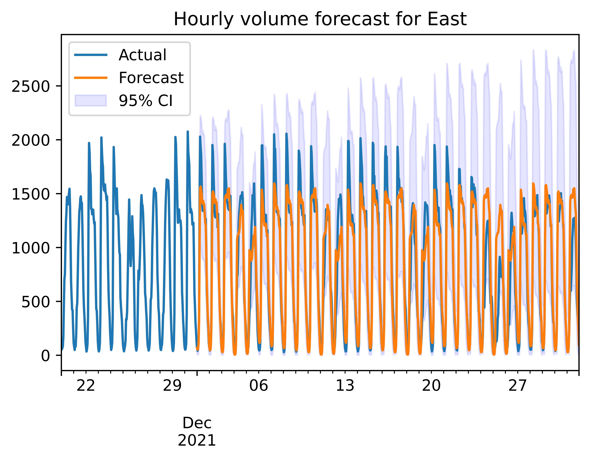

# Hourly Traffic Volume Forecasting using TBATS

## **Introduction**
The objective of this project is to forecast hourly traffic volume at a given traffic station. This volume forecast is important to facilitate traffic management decisions. For instance, intelligent transport systems can use traffic flow predictions to mitigate congestion.

For this project, we restrict our analysis to the following
* State: Massachusetts
* Station ID: 403
* Directions: East & West

## **Forecasts and App**

## **Model**
We consider two models that can capture multiple seasonalities - TBATS and Prophet. We compare their performance using RMSE on an out-of-sample test set. Note that SARIMA is not suitable because it cannot capture multiple seasonalities and we expect to see daily and weekly seasonalities in our data.

We trained TBATS and Prophet on data from Jan - Nov 2021, and tested on Dec 2021. We found that for both East and West, <ins>TBATS outperformed Prophet</ins>. This is likely due to XXXXX. The TBATS forecasts on the test sets are shown below.

## **Extensions**
* <ins>Yearly Seasonality</ins>. There is yearly seasonality in traffic volume - for instance, we might expect increased traffic volume in June due to the summer holidays. We can capture this yearly seasonality by using data spanning more than 1 year.
* <ins>Exogenous Variables</ins>. Hourly traffic volume is affected by exogenous variables such as weather and holidays. We can model this by using ARIMAX to incorporate the exogenous variables and fourier terms to capture the seasonality.
* <ins>Other Stations</ins>. Naturally, we can extend this to other states and stations.  

## **Data**
Our dataset is obtained from the Department of Transportation. It records daily traffic volume, binned by hour for year 2021. The volume data is collected using a mix of temporary and continuous traffic counting programs. Link to data: https://www.fhwa.dot.gov/policyinformation/tables/tmasdata/