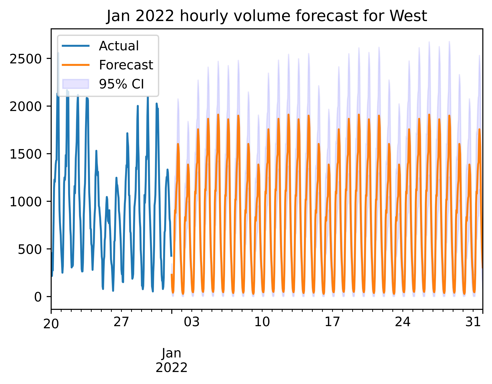

# Hourly Traffic Volume Forecasting App using TBATS & Flask

## **Introduction**
The objective of this project is to forecast hourly traffic volume at a given traffic station. This volume forecast is important to facilitate traffic management decisions. For instance, intelligent transport systems can use traffic flow predictions to mitigate congestion.

For this project, we restrict our analysis to the following
* State: Massachusetts
* Station: Elm Street, Concord (Station ID: 403)
* Directions: East & West

## **Flask App for Hourly Forecasts**
We deployed the model on a webapp using a Flask backend and a React frontend. The app can be accessed at [to be inserted] and screenshots are shown below.
   

## **TBATS Model**
We considered two models that can capture multiple seasonalities using Fourier series - TBATS and Prophet, and found that TBATS outperformed Prophet. Note that SARIMA models are not suitable because they cannot capture multiple seasonalities and we expect to see daily and weekly seasonalities in our data.

We trained TBATS and Prophet on data from Jan - Nov 2021 and compared their RMSE on data from Dec 2021, an out-of-sample test set. TBATS returned a lower RMSE for both East and West, likely due to Prophet's inability to model dependencies in the error term. The final TBATS model was trained on the full data set and the forecasts for Jan 2022 are shown below.

   

## **Limitations/Extensions**
* <ins>Yearly Seasonality</ins>. There is yearly seasonality in traffic volume - for instance, we might expect increased traffic volume in June due to the summer holidays. We can capture this yearly seasonality by using data spanning more than 1 year.
* <ins>Exogenous Variables</ins>. Hourly traffic volume is affected by exogenous variables such as weather and holidays. We can model this by using ARIMAX to incorporate the exogenous variables and fourier terms to capture the seasonality.
* <ins>Other Stations</ins>. Naturally, we can extend this to other states and stations.  

## **Data**
Our dataset was obtained from the Department of Transportation. It records daily traffic volume, The 2021 hourly volume data was collected using a mix of temporary and continuous traffic counting programs. Link: https://www.fhwa.dot.gov/policyinformation/tables/tmasdata/